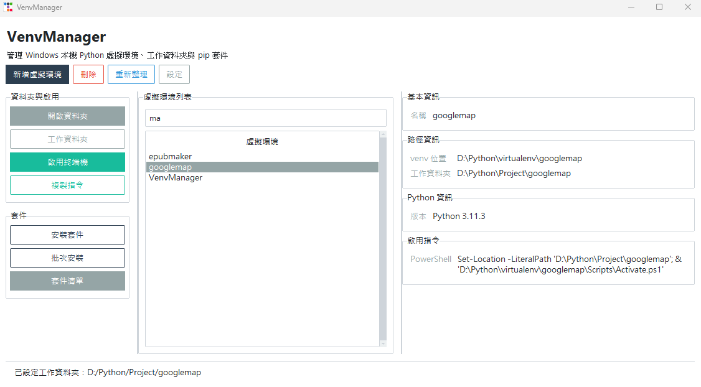

# VenvManager

VenvManager 是一個 Windows 友善的 Python 虛擬環境管理工具。它使用 tkinter、ttk 與 ttkbootstrap 製作 GUI，目標是保持簡單、容易維護，並能用 PyInstaller 打包成單一 Windows exe。



## 功能特色

- 建立、刪除、搜尋與列出虛擬環境
- 設定 venv 存放資料夾
- 自動掃描 Base Python，支援 Python Launcher 與完整 `python.exe` 路徑
- 建立 venv 前檢查 Base Python 是否可用
- 為每個 venv 設定對應的工作資料夾
- 另開 PowerShell 終端機，切到工作資料夾並啟用 venv
- 複製 PowerShell 啟用指令
- 安裝單一 pip 套件
- 從 requirements 檔案批次安裝套件
- 顯示已安裝套件，並輸出 requirements 快照

## 使用技術

- Python 3.11+
- tkinter / ttk
- ttkbootstrap
- PyInstaller onefile
- GitHub Actions

## 專案結構

```text
VenvManager/
├─ src/
│  └─ venv_manager/
│     ├─ __main__.py
│     ├─ app.py
│     ├─ config.py
│     ├─ paths.py
│     ├─ venv_service.py
│     ├─ ui/
│     └─ assets/
├─ tests/
├─ scripts/
├─ .github/workflows/
├─ pyproject.toml
├─ requirements.txt
├─ requirements-dev.txt
├─ README.md
└─ LICENSE
```

## 設定檔位置

設定檔不會放在 exe 旁邊，也不會放在 PyInstaller onefile 的暫存解壓縮目錄。Windows 會儲存在：

```text
%APPDATA%\VenvManager\config.json
```

設定檔會保存：

- venv 存放資料夾
- Base Python 選擇
- ttkbootstrap theme
- 每個 venv 對應的工作資料夾
- 上次開啟的資料夾

這樣即使 exe 更新、移動或重新打包，使用者設定仍會留在自己的 Windows 使用者資料夾。

## Requirements 快照

點選「套件清單」時，VenvManager 會讀取該 venv 的 `pip freeze`，並在目前設定的 venv 存放資料夾輸出：

```text
(venv_name)_requirements_python_Python 3.11.3.txt
```

例如 venv 根目錄設定為 `<venv_root>`，選取 `demo` 時可能產生：

```text
<venv_root>\demo_requirements_python_Python 3.11.3.txt
```

## 本機開發

```powershell
python -m venv .venv
.\.venv\Scripts\Activate.ps1
python -m pip install --upgrade pip
python -m pip install -r requirements.txt
python -m pip install -r requirements-dev.txt
python -m pip install -e .
```

## 執行

```powershell
python -m venv_manager
```

也可以使用 console script：

```powershell
venv-manager
```

## 檢查

```powershell
ruff check .
pytest
```

## 本機打包 onefile exe

```powershell
powershell -ExecutionPolicy Bypass -File scripts/build_exe.ps1
```

輸出檔案：

```text
dist/VenvManager.exe
```

`scripts/build_exe.ps1` 會使用 PyInstaller onefile 與 windowed 模式。如果 `src/venv_manager/assets/app.ico` 存在，會自動加入 icon；如果 icon 不存在，打包不會失敗。

## GitHub Actions

Windows exe 會在以下情境自動建立：

- push 版本 tag，例如 `v0.1.0`
- 手動執行 `workflow_dispatch`

流程完成後，在 GitHub Actions run 的 Artifacts 區塊下載：

```text
VenvManager-windows-onefile
```

裡面會包含：

```text
VenvManager.exe
```

## Onefile exe 限制

`VenvManager.exe` 可以在沒有安裝 Python 的電腦上啟動 GUI，但建立新的 venv 仍需要可用的 Base Python。使用者可以安裝 Python，或在設定中選擇偵測到的 Python / 指定完整 `python.exe` 路徑。

## License

MIT License
